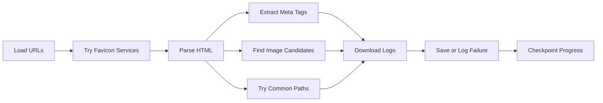

#  Logo Processing & Clustering

## Overview

This project automates the extraction and clustering of logos from websites using intelligent fallback strategies and perceptual hashing. It consists of two main stages:

1. ** Logo Extraction** – Downloads logos from websites using multiple strategies
2. ** Logo Clustering** – Groups visually similar logos using SVG-aware processing

---

##  Key Features

-  **Parallel Processing** – Up to 50 threads for high-speed extraction
-  **Intelligent Fallback** – Automatically switches HTTPS → HTTP when needed
-  **Multiple Extraction Methods** – Maximizes coverage across different website structures
-  **Smart Clustering** – Perceptual hashing, color analysis, brightness, contrast, and SVG detection
-  **Checkpoint System** – Resume interrupted processes seamlessly
-  **Comprehensive Metadata** – Structured results with detailed logs

---

##  Project Structure

```
.
├── LOGOS/                      # Extracted logos and metadata
│   ├── 0001.png               # Sequentially numbered logos
│   ├── 0002.jpg               
│   ├── [number]_FAILED.txt    # Logs for failed downloads
│   └── _METADATA.json         # Extraction metadata
├── logos.snappy.parquet       # Input URLs
├── oa.py                      # Logo extraction script
├── oa2.py                     # Logo clustering script
└── README.md                  # This file
```

---

## Quick Start

### Prerequisites

```bash
pip install pandas requests beautifulsoup4 Pillow imagehash numpy opencv-python cairosvg tqdm
```

### Extract Logos

```bash
python preprocessor.py
```

**What it does:**
- Loads URLs from `logos.snappy.parquet`
- Fetches logos using multiple methods:
  - Favicon services
  - HTML `<link>` tags
  - Open Graph / Twitter meta images
  - Common logo paths (`/logo.png`, `/favicon.ico`, etc.)
  - Candidate `` elements
- Saves results in `LOGOS/` directory
- Generates `_METADATA.json`
- Creates checkpoints (`ultra_checkpoint.pkl`) for resumable processing

### 2️⃣ Cluster Logos

```bash
python oa2.py
```

**What it does:**
- Loads all images from `LOGOS/` (supports PNG, JPG, JPEG, WEBP, ICO, SVG)
- Generates image signatures:
  - MD5 hash
  - Perceptual hashes (pHash, aHash)
  - Average color, brightness, contrast
  - Aspect ratio
  - File type detection (including SVG-in-PNG)
- Groups logos by similarity
- Produces:
  - `logo_groups.json` – Structured cluster data
  - `logo_summary.txt` – Human-readable summary

---

## 🔧 Technical Details

### Logo Extraction Workflow



**Extraction Methods:**
1. Favicon services (Google, DuckDuckGo, etc.)
2. HTML `<link rel="icon">` tags
3. Open Graph / Twitter Card images
4. Common paths (`/logo.png`, `/favicon.ico`, `/apple-touch-icon.png`)
5. Candidate `` elements in header/navigation

### Logos Workflow

**Signature Generation:**
- **MD5 Hash** – Exact duplicate detection
- **Perceptual Hashes** – Visual similarity (pHash, aHash)
- **Color Analysis** – Average RGB values
- **Image Properties** – Brightness, contrast, aspect ratio
- **Format Detection** – True file type (including SVG-in-PNG)

**Algorithm:**
- Weighted similarity scoring
- Adaptive thresholds based on color variance
- Groups: Exact duplicates → Similar → Unique

---

### Performance Optimization
- Multi-threaded extraction (configurable thread count)
- Memory management with batch processing
- Garbage collection between batches
- Rate limiting to avoid server overload

---

## 📦 Dependencies

```txt
pandas
requests
beautifulsoup4
Pillow
imagehash
numpy
opencv-python
cairosvg
tqdm
```

---

\
